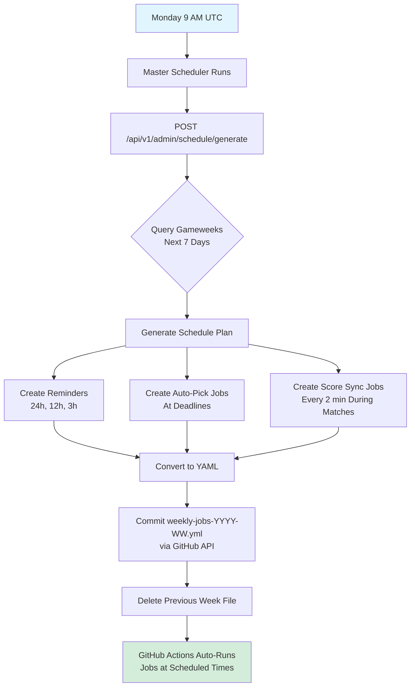

# Deployment Guide - Premier League Predictions

This guide covers deploying the Premier League Predictions application to production.

## Table of Contents
- [GitHub Actions Scheduler Setup](#github-actions-scheduler-setup)
- [Database Migrations](#database-migrations)
- [Render.com Deployment](#rendercom-deployment)
- [Manual Deployment](#manual-deployment)
- [Environment Variables](#environment-variables)
- [Health Checks](#health-checks)
- [Troubleshooting GitHub Actions](#troubleshooting-github-actions)

---

## GitHub Actions Scheduler Setup

The application uses **GitHub Actions** to schedule automated tasks (reminders, auto-picks, score syncing). A master scheduler runs every Monday at 9 AM UTC and generates dynamic workflow files for the upcoming week.

### Prerequisites

1. **GitHub Personal Access Token** with `repo` and `workflow` permissions
2. **API Key** for external sync operations (already exists as `EXTERNAL_SYNC_API_KEY`)

### Setup Steps

#### 1. Create GitHub Personal Access Token

1. Go to [GitHub Settings > Personal Access Tokens > Tokens (classic)](https://github.com/settings/tokens)
2. Click "Generate new token (classic)"
3. Set description: `PremierLeague Scheduler`
4. Select scopes:
   - ✅ `repo` (Full control of private repositories)
   - ✅ `workflow` (Update GitHub Action workflows)
5. Click "Generate token"
6. **Copy the token immediately** (you won't see it again)

#### 2. Add Token to Render Environment Variables

In your Render.com dashboard:

1. Go to your API service
2. Navigate to "Environment" tab
3. Add new environment variable:
   ```
   Key:   GitHub__PersonalAccessToken
   Value: ghp_your_token_here
   ```
4. Click "Save Changes"

#### 3. Configure appsettings.json (Already Done)

The following configuration is already set in `appsettings.json`:

```json
{
  "ApiBaseUrl": "https://api.eplpredict.com",
  "GitHub": {
    "Owner": "your-github-username",
    "Repository": "PremierLeaguePredictions",
    "PersonalAccessToken": ""  // Read from environment variable
  }
}
```

Update `GitHub:Owner` to match your GitHub username if needed.

#### 4. Verify API Key Secret Exists

Check your GitHub repository secrets:

1. Go to repository Settings > Secrets and variables > Actions
2. Verify `EXTERNAL_SYNC_API_KEY` exists
3. If not, add it:
   ```
   Name:  EXTERNAL_SYNC_API_KEY
   Value: your-api-key-here
   ```

This is used by generated workflows to authenticate API calls.

### How It Works



### Generated Workflow Example

The system generates workflow files like `.github/workflows/weekly-jobs-2025-W49.yml`:

```yaml
name: Weekly Jobs - 2025-W49
on:
  schedule:
    - cron: '0 15 5 12 *'      # Reminder 24h before GW14
    - cron: '0 3 6 12 *'       # Reminder 12h before GW14
    - cron: '0 15 6 12 *'      # Reminder 3h before GW14
    - cron: '0 18 6 12 *'      # Auto-pick at GW14 deadline
    - cron: '*/2 15-17 6 12 *' # Live scores during 3 PM matches
    - cron: '*/2 19-21 6 12 *' # Live scores during 7:30 PM match
  workflow_dispatch:           # Manual trigger support

jobs:
  send-reminders:
    if: |
      github.event.schedule == '0 15 5 12 *' ||
      github.event.schedule == '0 3 6 12 *' ||
      github.event.schedule == '0 15 6 12 *'
    runs-on: ubuntu-latest
    steps:
      - name: Send pick reminders
        run: |
          curl -X POST https://api.eplpredict.com/api/v1/admin/schedule/reminders \
            -H "X-API-Key: ${{ secrets.EXTERNAL_SYNC_API_KEY }}" \
            -H "Content-Type: application/json"

  auto-pick:
    if: github.event.schedule == '0 18 6 12 *'
    runs-on: ubuntu-latest
    steps:
      - name: Run auto-pick assignment
        run: |
          curl -X POST https://api.eplpredict.com/api/v1/admin/schedule/auto-pick \
            -H "X-API-Key: ${{ secrets.EXTERNAL_SYNC_API_KEY }}" \
            -H "Content-Type: application/json"

  sync-scores:
    if: |
      github.event.schedule == '*/2 15-17 6 12 *' ||
      github.event.schedule == '*/2 19-21 6 12 *'
    runs-on: ubuntu-latest
    steps:
      - name: Sync live scores
        run: |
          curl -X POST https://api.eplpredict.com/api/v1/dev/fixtures/sync-results \
            -H "X-API-Key: ${{ secrets.EXTERNAL_SYNC_API_KEY }}" \
            -H "Content-Type: application/json"
```

### Cost Analysis

**GitHub Actions Free Tier:** 2,000 minutes/month

**Estimated Usage per Week:**
- Master scheduler: 1 run × 1 min = **1 min**
- Reminders: ~6 gameweeks × 3 reminders × 0.5 min = **9 min**
- Auto-pick: ~6 gameweeks × 0.5 min = **3 min**
- Score sync: ~8 match windows × 60 min × (2 min / 2 min interval) = **240 min** (worst case, usually ~90 min)

**Total:** ~45-240 minutes/month (well within free tier)

### Manual Trigger

You can manually trigger the schedule generation:

1. Go to GitHub repository > Actions tab
2. Select "Master Scheduler" workflow
3. Click "Run workflow" button
4. Select branch (usually `main`)
5. Click "Run workflow"

---

## Database Migrations

**IMPORTANT:** Database migrations are NOT run automatically on application startup in production. This prevents race conditions in multi-instance deployments.

### Automatic Migration (Render.com)

When deploying to Render.com, migrations are run automatically via the `preDeployCommand` in `render.yaml`:

```yaml
preDeployCommand: "cd /app && dotnet ef database update --no-build"
```

This ensures migrations run once before the new application version starts.

### Manual Migration Scripts

For other deployment environments, use the provided migration scripts:

#### Linux/macOS:
```bash
# Set connection string
export ConnectionStrings__DefaultConnection="Host=your-host;Database=your-db;Username=user;Password=pass"

# Run migrations
./scripts/run-migrations.sh
```

#### Windows (PowerShell):
```powershell
# Set connection string
$env:ConnectionStrings__DefaultConnection = "Host=your-host;Database=your-db;Username=user;Password=pass"

# Run migrations
.\scripts\run-migrations.ps1
```

### Using EF Core CLI Directly

If you have the .NET SDK installed:

```bash
cd backend/PremierLeaguePredictions.API

# Update database to latest migration
dotnet ef database update --connection "your-connection-string"

# List pending migrations
dotnet ef migrations list

# Generate SQL script for review
dotnet ef migrations script > migration.sql
```

### Development Environment

In development, migrations run automatically on startup. This is controlled by the `RunMigrationsOnStartup` setting:

```json
// appsettings.Development.json
{
  "RunMigrationsOnStartup": true  // Only true in development
}
```

**Production:** This setting defaults to `false` but has exceptions (see below).

---

## Render.com Deployment

### Important: Free Tier Limitations

**Render.com Free Tier** does not support `preDeployCommand`, which is the recommended way to run migrations before deployment. As a workaround for free tier deployments, migrations are configured to run on application startup.

**Configuration in render.yaml:**
```yaml
envVars:
  - key: RunMigrationsOnStartup
    value: true  # Required for Render free tier
```

⚠️ **Tradeoff:** This means migrations run on every application restart, which is acceptable for single-instance free tier deployments but should be avoided in multi-instance production deployments (paid tiers).

**For Paid Tiers:** Use `preDeployCommand` instead:
```yaml
preDeployCommand: "cd /app && dotnet ef database update --no-build"
envVars:
  - key: RunMigrationsOnStartup
    value: false  # Disable for paid tier
```

### Prerequisites
1. Render.com account (free or paid tier)
2. GitHub repository connected to Render
3. Supabase PostgreSQL database (or other hosted PostgreSQL)

### Deployment Steps

1. **Connect Repository**
   - Go to Render Dashboard
   - Select "New Web Service"
   - Connect your GitHub repository

2. **Configure Service**
   - Render will auto-detect `render.yaml`
   - Service name: `premierleague-api`
   - Region: Oregon (or your preferred region)
   - Build: Uses Docker (configured in render.yaml)

3. **Set Environment Variables**

   Required variables (set in Render Dashboard):
   ```
   ConnectionStrings__DefaultConnection  # PostgreSQL connection string
   Google__ClientId                      # Google OAuth client ID
   FootballData__ApiKey                  # Football Data API key
   AllowedOrigins__0                     # Frontend URL (e.g., https://your-app.com)
   ```

   Auto-generated by Render:
   ```
   JWT__Secret                          # Auto-generated secure secret
   ```

4. **Deploy**
   - Click "Create Web Service"
   - Render will:
     1. Build the Docker image
     2. Start the application
     3. Run migrations on first startup (via `RunMigrationsOnStartup`)
     4. Run health checks

5. **Verify Deployment**
   - Check health endpoint: `https://your-app.onrender.com/health`
   - Review logs in Render Dashboard for migration success
   - Test authentication and API endpoints

### Render.yaml Configuration

**Free Tier Configuration (current):**
```yaml
services:
  - type: web
    name: premierleague-api
    runtime: docker
    region: oregon
    rootDir: backend
    dockerfilePath: ./Dockerfile
    healthCheckPath: /health
    envVars:
      - key: ASPNETCORE_ENVIRONMENT
        value: Production
      - key: RunMigrationsOnStartup
        value: true  # Migrations run on app startup (free tier workaround)
      # ... other environment variables
```

**Paid Tier Configuration (recommended for production):**
```yaml
services:
  - type: web
    name: premierleague-api
    runtime: docker
    region: oregon
    rootDir: backend
    dockerfilePath: ./Dockerfile
    preDeployCommand: "cd /app && dotnet ef database update --no-build"
    healthCheckPath: /health
    envVars:
      - key: ASPNETCORE_ENVIRONMENT
        value: Production
      - key: RunMigrationsOnStartup
        value: false  # Migrations run via preDeployCommand
      # ... other environment variables
```

---

## Manual Deployment

For deploying to custom infrastructure (Azure, AWS, on-premises):

### 1. Build the Application

```bash
cd backend/PremierLeaguePredictions.API
dotnet publish -c Release -o ./publish
```

### 2. Run Migrations

```bash
# Set connection string
export ConnectionStrings__DefaultConnection="your-connection-string"

# Run migration script
./scripts/run-migrations.sh
```

### 3. Deploy Application

```bash
# Copy published files to server
scp -r ./publish/* user@server:/var/www/premierleague-api/

# Set up systemd service (Linux)
sudo systemctl start premierleague-api
sudo systemctl enable premierleague-api
```

### 4. Configure Reverse Proxy

**Nginx Example:**
```nginx
server {
    listen 443 ssl;
    server_name api.yourapp.com;

    ssl_certificate /path/to/cert.pem;
    ssl_certificate_key /path/to/key.pem;

    location / {
        proxy_pass http://localhost:5000;
        proxy_http_version 1.1;
        proxy_set_header Upgrade $http_upgrade;
        proxy_set_header Connection keep-alive;
        proxy_set_header Host $host;
        proxy_cache_bypass $http_upgrade;
        proxy_set_header X-Forwarded-For $proxy_add_x_forwarded_for;
        proxy_set_header X-Forwarded-Proto $scheme;
    }
}
```

---

## Environment Variables

### Required Production Variables

```bash
# Database
ConnectionStrings__DefaultConnection="Host=host;Database=db;Username=user;Password=pass"

# JWT Authentication
JWT__Secret="your-secure-secret-minimum-32-characters-long"
JWT__Issuer="PremierLeaguePredictionsAPI"
JWT__Audience="PremierLeaguePredictionsClient"
JWT__ExpirationInMinutes="1440"

# Google OAuth
Google__ClientId="your-google-client-id.apps.googleusercontent.com"

# Football Data API
FootballData__ApiKey="your-football-data-api-key"

# CORS
AllowedOrigins__0="https://your-frontend-url.com"

# GitHub Actions Scheduler
GitHub__Owner="your-github-username"
GitHub__Repository="PremierLeaguePredictions"
GitHub__PersonalAccessToken="ghp_your_token_here"
ApiBaseUrl="https://api.eplpredict.com"

# Optional: Email (for notifications)
Email__SmtpHost="smtp.gmail.com"
Email__SmtpPort="587"
Email__SmtpUsername="your-email@gmail.com"
Email__SmtpPassword="your-app-password"
Email__FromEmail="noreply@yourapp.com"
Email__FromName="Premier League Predictions"
Email__EnableSsl="true"
```

### Development-Only Variables

```bash
# Development settings (DO NOT USE IN PRODUCTION)
DisableAuthorizationInDevelopment="false"  # Must be false in production
RunMigrationsOnStartup="false"            # Must be false in production
```

---

## Health Checks

The application exposes health check endpoints for monitoring:

### Primary Health Check
```
GET /health
```

Returns overall application health including:
- Application status
- Database connectivity
- SignalR hub status

**Response Example:**
```json
{
  "status": "Healthy",
  "checks": [
    {
      "name": "database",
      "status": "Healthy",
      "description": "PostgreSQL connection",
      "duration": 15.2
    },
    {
      "name": "signalr",
      "status": "Healthy",
      "description": "SignalR hub",
      "duration": 2.1
    }
  ],
  "totalDuration": 17.3
}
```

### Monitoring Setup

Configure your monitoring tool to check `/health` endpoint:
- **Interval:** Every 30-60 seconds
- **Timeout:** 5 seconds
- **Success:** HTTP 200 status
- **Alert:** If unhealthy for 2+ consecutive checks

**Render.com:** Automatically configured via `healthCheckPath` in render.yaml

---

## Rollback Procedure

If deployment fails or issues are detected:

### 1. Rollback Application

**Render.com:**
- Go to service dashboard
- Click "Rollbacks" tab
- Select previous working deployment
- Click "Rollback"

**Manual:**
```bash
# Deploy previous version
git checkout <previous-tag>
./scripts/deploy.sh
```

### 2. Rollback Database (if needed)

**⚠️ WARNING:** Database rollbacks are risky. Test thoroughly first.

```bash
# Revert to specific migration
dotnet ef database update <migration-name> --connection "connection-string"

# Example: Revert to migration before breaking change
dotnet ef database update AddPickRulesTable --connection "connection-string"
```

---

## Troubleshooting

### Migrations Fail

**Error:** "A connection was successfully established with the server..."
- **Solution:** Check connection string format and database accessibility

**Error:** "The migration has already been applied"
- **Solution:** Safe to ignore, migration is idempotent

### Application Won't Start

**Check logs:**
```bash
# Render.com: View in dashboard logs tab
# Manual: Check application logs
tail -f /var/log/premierleague-api/app.log
```

**Common issues:**
1. Missing environment variables
2. Database connection failure
3. Port already in use (manual deployments)

### Rate Limiting Issues

If users hit rate limits:
- Adjust limits in `appsettings.json` under `IpRateLimiting`
- Consider using Redis for distributed rate limiting in multi-instance deployments

---

## Production Checklist

Before deploying to production:

- [ ] All secrets removed from appsettings.json
- [ ] Environment variables configured correctly
- [ ] `RunMigrationsOnStartup` is `false`
- [ ] HTTPS enforced (`RequireHttpsMetadata` = true)
- [ ] Rate limiting configured
- [ ] Health checks working
- [ ] Database backups configured
- [ ] Monitoring/alerting set up
- [ ] CORS allowed origins configured
- [ ] Test migration rollback procedure
- [ ] Document any manual migration steps

---

## Troubleshooting GitHub Actions

### Master Scheduler Not Running

**Symptom:** No workflow files generated on Monday mornings

**Check:**
1. Verify `.github/workflows/master-scheduler.yml` exists in repository
2. Check Actions tab for failed runs
3. Verify repository has Actions enabled (Settings > Actions > General)

**Solution:**
```bash
# Manual trigger via GitHub CLI
gh workflow run master-scheduler.yml

# Or via web UI: Actions > Master Scheduler > Run workflow
```

### Schedule Generation Fails

**Error:** "Failed to generate workflow: GitHub API error"

**Possible Causes:**
1. **Invalid Personal Access Token**
   - Check token hasn't expired
   - Verify token has `repo` and `workflow` scopes
   - Regenerate token if needed

2. **Missing Environment Variable**
   ```bash
   # Verify in Render dashboard or logs
   echo $GitHub__PersonalAccessToken
   ```

3. **Repository Name Mismatch**
   - Check `appsettings.json` → `GitHub:Owner` and `GitHub:Repository`
   - Must match your actual GitHub username/repo name

**Debug:**
```bash
# Check API logs for detailed error
# Render: Dashboard > Logs > Filter "schedule"
# Look for POST /api/v1/admin/schedule/generate requests
```

### Workflow Jobs Not Executing

**Symptom:** Workflow file exists but jobs don't run at scheduled times

**Check:**
1. **Verify Cron Expression Timing**
   ```bash
   # Cron runs on UTC time
   # '0 15 6 12 *' = 3:00 PM UTC on Dec 6
   # Convert to your local timezone if needed
   ```

2. **Check GitHub Actions Logs**
   - Go to Actions tab
   - Find the workflow run (may be hidden if it failed early)
   - Review logs for errors

3. **API Endpoint Errors**
   ```bash
   # Test endpoint manually
   curl -X POST https://api.eplpredict.com/api/v1/admin/schedule/reminders \
     -H "X-API-Key: $EXTERNAL_SYNC_API_KEY" \
     -H "Content-Type: application/json" \
     -v

   # Should return 200 OK
   ```

**Common Issues:**
- **401 Unauthorized:** Check `EXTERNAL_SYNC_API_KEY` secret is set correctly
- **404 Not Found:** Verify API URL is correct (check for `/api/v1/` prefix)
- **500 Server Error:** Check API logs for internal errors

### Duplicate Jobs Running

**Symptom:** Multiple workflow files executing at same time

**Cause:** Old workflow files not cleaned up

**Solution:**
```bash
# Manually delete old workflow files
# Go to .github/workflows/ and delete weekly-jobs-*.yml files older than current week

# Or trigger schedule generation to auto-cleanup
gh workflow run master-scheduler.yml
```

### Reminders Not Sending

**Error:** Job runs but no emails sent

**Check:**
1. **Email Configuration**
   ```bash
   # Verify SMTP settings in environment variables
   Email__SmtpHost, Email__SmtpPort, Email__SmtpUsername, etc.
   ```

2. **User Email Addresses**
   ```sql
   -- Check users have valid email addresses
   SELECT "Email", "FirstName", "LastName" FROM "Users" WHERE "Email" IS NULL OR "Email" = '';
   ```

3. **API Logs**
   ```bash
   # Check for errors in PickReminderService
   # Look for "Sending pick reminders" log entries
   ```

### Score Sync Not Updating

**Symptom:** Live scores not refreshing during matches

**Check:**
1. **Football-Data.org API Key**
   ```bash
   # Verify API key is valid and hasn't hit rate limits
   # Free tier: 10 requests/minute
   ```

2. **Match Time Windows**
   ```yaml
   # Verify cron expression matches actual kickoff times
   # Example: '*/2 15-17 6 12 *' syncs 3-5 PM UTC on Dec 6
   # Premier League matches may be at different times
   ```

3. **Test Manual Sync**
   ```bash
   curl -X POST https://api.eplpredict.com/api/v1/dev/fixtures/sync-results \
     -H "X-API-Key: $EXTERNAL_SYNC_API_KEY" \
     -H "Content-Type: application/json"

   # Check response for updated fixtures
   ```

### GitHub Actions Minutes Exceeded

**Error:** "You have exceeded your included minutes"

**Cause:** Too many workflow runs or long-running jobs

**Check Usage:**
1. Go to GitHub Settings > Billing > Plans and usage
2. View Actions minutes consumed

**Solutions:**
1. **Optimize Score Sync Intervals**
   - Change from every 2 minutes to every 5 minutes
   - Reduce match window durations

2. **Disable Score Sync During Off-Hours**
   - Only sync during actual match times
   - Skip syncing for postponed/canceled matches

3. **Upgrade to GitHub Pro** ($4/month = 3,000 minutes)

### Debugging Tips

**View Detailed Logs:**
```bash
# Enable debug logging in workflow
# Edit master-scheduler.yml or generated workflow:
env:
  ACTIONS_RUNNER_DEBUG: true
  ACTIONS_STEP_DEBUG: true
```

**Test Locally:**
```bash
# Simulate workflow job locally
curl -X POST http://localhost:5000/api/v1/admin/schedule/generate \
  -H "X-API-Key: your-api-key"

# Check generated SchedulePlan
```

**Common Error Messages:**

| Error | Cause | Solution |
|-------|-------|----------|
| `Resource not accessible by integration` | Token lacks required scopes | Regenerate token with `repo` + `workflow` |
| `Reference does not exist` | Branch name mismatch | Check `ref` in API calls matches actual branch |
| `Workflow does not exist` | File path wrong | Verify `.github/workflows/` path |
| `Rate limit exceeded` | Too many API calls | Wait or upgrade GitHub plan |

---

## Support

For deployment issues:
1. Check application logs
2. Review Render.com build logs (if applicable)
3. Verify all environment variables are set
4. Test database connectivity
5. Check health endpoint response
6. Review GitHub Actions logs for scheduler issues

For questions or issues, create a GitHub issue or contact the development team.
