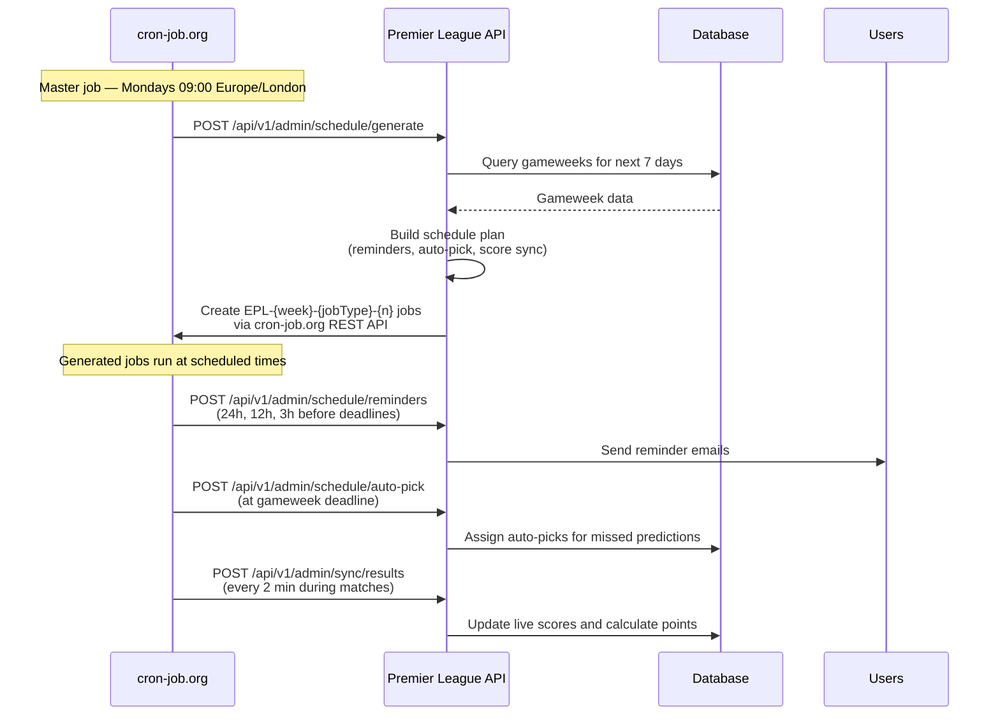

# Premier League Predictions

A full-stack web application for making weekly Premier League predictions and competing with friends in a fantasy-style prediction league.

## Overview

Premier League Predictions is a competitive prediction game where users select one team to win each gameweek. The application automatically tracks predictions, calculates points based on real match results from the Football-Data.org API, and maintains live league standings with detailed statistics.

## Tech Stack

### Frontend
- **React 18** - Modern component-based UI library
- **TypeScript** - Full type safety
- **Vite** - Fast development and optimized builds
- **TanStack Query (React Query)** - Server state management and caching
- **React Router v6** - Client-side routing
- **Tailwind CSS** - Utility-first styling
- **shadcn/ui** - High-quality component library
- **Vercel** - Frontend hosting (optional)

### Backend
- **.NET 9.0** - Modern ASP.NET Core Web API
- **Clean Architecture** - Separated Core, Application, Infrastructure, and API layers
- **Entity Framework Core** - Code-first database migrations and ORM
- **PostgreSQL** - Production-grade relational database
- **JWT Authentication** - Secure token-based authentication
- **Google OAuth** - Single sign-on integration
- **Repository Pattern** - Unit of Work for clean data access
- **football-data.org API** - Live Premier League fixture and result data
- **cron-job.org** - External cron service for scheduling reminders, auto-picks, and score sync
- **GitHub Actions** - CI/CD (test, build, deploy) only
- **Render** - API hosting (Docker)
- **Supabase** - Database hosting (PostgreSQL)

## Game Rules

### Predictions
- Each gameweek, select **one** Premier League team to win their match
- Predictions must be submitted before the gameweek deadline
- You cannot change your prediction after the deadline passes

### Scoring
Points are awarded based on your selected team's match result:
- **Win**: 3 points + goals scored and conceded tracked
- **Draw**: 1 point + goals scored and conceded tracked
- **Loss**: 0 points + goals scored and conceded tracked

### League Standings
Users are ranked by:
1. **Total Points** (primary)
2. **Goal Difference** (tiebreaker)
3. **Goals For** (second tiebreaker)

Statistics tracked:
- Wins, Draws, Losses (W-D-L record)
- Goals For, Goals Against, Goal Difference
- Total Picks Made (only completed gameweeks count)

## Features

### Core Functionality
- **Google OAuth Authentication** - Secure single sign-on with Google
- **Personal Dashboard** - View your picks, upcoming fixtures, and performance statistics
- **Weekly Predictions** - Select one team to win per gameweek
- **Automatic Scoring** - Points calculated automatically from live match results
- **League Standings** - Real-time rankings with points, W-D-L records, and goal statistics
- **Fixtures View** - Color-coded display of all matches showing picked teams
- **Responsive Design** - Full mobile support with light/dark theme toggle

### Admin Features
- **Season Management** - Sync teams and fixtures from Football-Data.org API
- **Gameweek Creation** - Automatically create gameweeks from fixture data
- **Backfill Picks** - Enter historical picks for past gameweeks
- **User Management** - View and manage league participants

### Automated Task Scheduling

The application uses **cron-job.org** (an external cron service) instead of traditional background services. This provides:
- **Resource efficiency** - Jobs only run when needed (no 24/7 polling)
- **Reliability** - Survives app downtime and restarts
- **Precision** - Exact cron timing for reminders and score updates
- **Off-season safe** - Generates zero jobs when there are no upcoming fixtures

A single weekly **master job** (Mondays 09:00 Europe/London) calls the API, which generates the per-week schedule and creates the individual jobs via the cron-job.org REST API. GitHub Actions is used for CI/CD only.

> See [LIVE_SCORES_SETUP.md](LIVE_SCORES_SETUP.md) for the full flow and setup, and [DEPLOYMENT.md](DEPLOYMENT.md#cron-joborg-scheduler-setup) for deployment configuration.

#### How It Works



#### Scheduled Jobs
- **Reminders**: Sent 24h, 12h, and 3h before each gameweek deadline
- **Auto-Pick**: Assigns teams to users who missed the deadline
- **Live Score Sync**: Updates scores every 2 minutes during match windows (grouped by 15-minute kickoff intervals)

All schedules are generated dynamically based on actual fixture dates from Football-Data.org. Generated jobs authenticate to the API via an `?apiKey=` query parameter (the ExternalSync key).

## Project Structure

```
PremierLeaguePredictions/
├── .github/
│   └── workflows/                  # CI/CD only (test, build, deploy) — scheduling is on cron-job.org
├── backend/
│   ├── PremierLeaguePredictions.API/
│   │   ├── Controllers/
│   │   │   └── Admin/
│   │   │       └── AdminScheduleController.cs  # Schedule generation endpoints
│   │   └── ...                     # Web API controllers, middleware, filters
│   ├── PremierLeaguePredictions.Application/
│   │   ├── DTOs/
│   │   │   └── SchedulePlan.cs     # Schedule planning DTOs
│   │   ├── Services/
│   │   │   └── CronSchedulerService.cs  # Core scheduling logic
│   │   └── ...                     # Business logic, services, DTOs
│   ├── PremierLeaguePredictions.Core/           # Domain entities, interfaces
│   ├── PremierLeaguePredictions.Infrastructure/
│   │   ├── Services/
│   │   │   ├── CronJobsOrgService.cs     # Create/delete cron-job.org jobs
│   │   │   └── CronJobsOrgClient.cs      # cron-job.org REST API client
│   │   └── ...                     # EF Core, repositories, external APIs
│   ├── PremierLeaguePredictions.Tests/          # Unit and integration tests
│   ├── Dockerfile                               # Docker container configuration
│   └── RENDER_DEPLOYMENT.md                     # Deployment guide for Render
├── frontend/
│   ├── src/
│   │   ├── components/    # Reusable React components
│   │   ├── contexts/      # Auth and Theme contexts
│   │   ├── pages/         # Route page components
│   │   ├── services/      # API client services
│   │   └── types/         # TypeScript type definitions
│   └── public/            # Static assets
└── ...                    # Render services configured manually in the dashboard (no render.yaml)
```

## Getting Started

### Prerequisites

- .NET 9.0 SDK
- Node.js 18+
- PostgreSQL 14+
- Google OAuth Client ID ([Get one here](https://console.cloud.google.com/))
- Football-Data.org API Key ([Get one here](https://www.football-data.org/))

### Backend Setup

1. Navigate to the backend directory:
```bash
cd backend
```

2. Create `appsettings.Development.json` based on the example file:
```json
{
  "ConnectionStrings": {
    "DefaultConnection": "Host=localhost;Database=premierleague;Username=postgres;Password=yourpassword"
  },
  "JWT": {
    "Secret": "your-secret-key-minimum-32-characters-long",
    "Issuer": "PremierLeaguePredictions",
    "Audience": "PremierLeaguePredictions",
    "ExpirationInMinutes": 43200
  },
  "Google": {
    "ClientId": "your-google-oauth-client-id.apps.googleusercontent.com"
  },
  "FootballData": {
    "ApiKey": "your-football-data-api-key"
  },
  "AllowedOrigins": {
    "0": "http://localhost:5173"
  }
}
```

3. Create the database:
```bash
dotnet ef database update --project PremierLeaguePredictions.Infrastructure --startup-project PremierLeaguePredictions.API
```

4. Run the API:
```bash
cd PremierLeaguePredictions.API
dotnet run
```

The API will be available at `http://localhost:5000`

### Frontend Setup

1. Navigate to the frontend directory:
```bash
cd frontend
```

2. Install dependencies:
```bash
npm install
```

3. Create `.env.local`:
```env
VITE_API_URL=http://localhost:5000
VITE_GOOGLE_CLIENT_ID=your-google-oauth-client-id.apps.googleusercontent.com
```

4. Run the development server:
```bash
npm run dev
```

The app will be available at `http://localhost:5173`

### Initial Data Setup

1. Log in to the application with your Google account
2. The first user is automatically assigned admin privileges
3. Navigate to the Admin panel
4. Click "Sync Teams" to import all Premier League teams
5. Click "Sync Current Season Fixtures" to import fixtures and create gameweeks

## Deployment

The application is configured for deployment on [Render.com](https://render.com) using Docker containers and [Supabase](https://supabase.com) for the database.

See [backend/RENDER_DEPLOYMENT.md](backend/RENDER_DEPLOYMENT.md) for detailed deployment instructions.

### Deploying to Render (manual)

Render's free tier does not support Blueprints (`render.yaml`), so each service is created and configured **manually in the Render dashboard**:

1. Push your code to GitHub
2. Create a new Web Service in Render and connect your repository
3. Configure the service by hand: Docker runtime, Root Directory `backend`, Dockerfile `./Dockerfile`, and Settings → Health Check Path = `/health`
4. Set environment variables manually in the service's Environment tab, e.g.:
   - `ConnectionStrings__DefaultConnection` (Supabase)
   - `Google__ClientId`
   - `FootballData__ApiKey`
   - `AllowedOrigins__0`
   - `RunMigrationsOnStartup=true` (migrations run on startup on the free tier)
5. Deploy the API (Docker) and the frontend (static site) as separate services

See [backend/RENDER_DEPLOYMENT.md](backend/RENDER_DEPLOYMENT.md) for the full step-by-step guide.

## API Documentation

### Authentication
- `POST /auth/google` - Authenticate with Google OAuth token

### Picks
- `GET /picks` - Get current user's picks
- `POST /picks` - Create a new pick
- `PUT /picks/{id}` - Update an existing pick

### Dashboard
- `GET /dashboard` - Get user dashboard with stats and upcoming fixtures

### League
- `GET /league/standings` - Get league standings with all user stats

### Admin (requires admin role)
- `POST /admin/teams/sync` - Sync teams from Football-Data.org
- `POST /admin/fixtures/sync` - Sync current season fixtures
- `POST /admin/picks/backfill` - Backfill picks for past gameweeks

## Development

### Running Tests
```bash
cd backend
dotnet test
```

### Database Migrations

Create a new migration:
```bash
dotnet ef migrations add MigrationName --project PremierLeaguePredictions.Infrastructure --startup-project PremierLeaguePredictions.API
```

Apply migrations:
```bash
dotnet ef database update --project PremierLeaguePredictions.Infrastructure --startup-project PremierLeaguePredictions.API
```

### Building for Production

Backend:
```bash
cd backend
dotnet publish -c Release
```

Frontend:
```bash
cd frontend
npm run build
```

## Contributing

This is a private project. If you have access and want to contribute:
- Create a feature branch from `main`
- Make your changes with clear commit messages
- Test thoroughly before submitting a pull request
- Ensure all tests pass and no linting errors exist

## License

This project is private and not licensed for public use.

## Credits

- Football data provided by [Football-Data.org](https://www.football-data.org/)
- Premier League logo and trademarks are property of the Premier League
