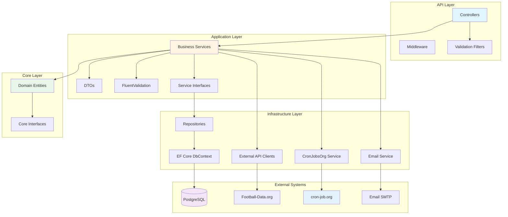
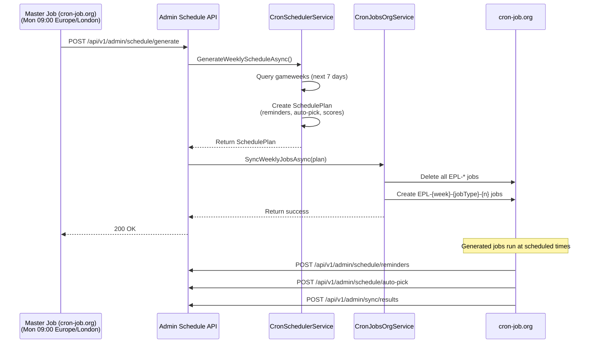

# Premier League Predictions - Backend API

ASP.NET Core Web API for the Premier League Predictions application.

## Tech Stack

- **ASP.NET Core 9.0** - Web framework
- **Entity Framework Core 9.0** - ORM and migrations
- **PostgreSQL** - Relational database
- **JWT Bearer** - Authentication
- **Google OAuth** - Social login
- **FluentValidation** - Request validation
- **Serilog** - Structured logging
- **SignalR** - Real-time notifications
- **cron-job.org** - External cron service for automated task scheduling
- **Football-Data.org API** - Live fixture and result data

## Architecture Overview

The backend follows **Clean Architecture** principles with clear separation of concerns:


```mermaid
graph TB
    subgraph "API Layer"
        Controllers[Controllers]
        Middleware[Middleware]
        Filters[Validation Filters]
    end

    subgraph "Application Layer"
        Services[Business Services]
        DTOs[DTOs]
        Validators[FluentValidation]
        Interfaces[Service Interfaces]
    end

    subgraph "Infrastructure Layer"
        Repositories[Repositories]
        DbContext[EF Core DbContext]
        ExternalAPIs[External API Clients]
        CronService[CronJobsOrg Service]
        EmailService[Email Service]
    end

    subgraph "Core Layer"
        Entities[Domain Entities]
        CoreInterfaces[Core Interfaces]
    end

    subgraph "External Systems"
        DB[(PostgreSQL)]
        FootballAPI[Football-Data.org]
        CronOrg[cron-job.org]
        SMTP[Email SMTP]
    end

    Controllers --> Services
    Controllers --> Filters
    Services --> Interfaces
    Services --> DTOs
    Services --> Validators
    Interfaces --> Repositories
    Repositories --> DbContext
    DbContext --> DB
    Services --> ExternalAPIs
    ExternalAPIs --> FootballAPI
    Services --> CronService
    CronService --> CronOrg
    Services --> EmailService
    EmailService --> SMTP
    Entities --> CoreInterfaces
    Services --> Entities

    style Controllers fill:#e1f5ff
    style Services fill:#fff4e1
    style Entities fill:#e8f5e9
    style DB fill:#f3e5f5
    style CronOrg fill:#e3f2fd
```

### Project Layers

1. **PremierLeaguePredictions.API**
   - Controllers (REST endpoints)
   - Middleware (exception handling, logging)
   - Authorization policies
   - API versioning
   - Swagger/OpenAPI

2. **PremierLeaguePredictions.Application**
   - Business logic services
   - DTOs (Data Transfer Objects)
   - FluentValidation validators
   - Service interfaces

3. **PremierLeaguePredictions.Infrastructure**
   - EF Core repositories
   - Database context and configurations
   - External API clients (Football-Data.org, cron-job.org)
   - Email service
   - Task scheduling via cron-job.org integration

4. **PremierLeaguePredictions.Core**
   - Domain entities (User, Team, Fixture, Pick, etc.)
   - Core interfaces (IRepository, IUnitOfWork)
   - Business rules

### Automated Task Scheduling

The application uses **cron-job.org** (an external cron service) instead of traditional background services. A weekly master job calls the API, which generates the per-week schedule and creates individual jobs via the cron-job.org REST API. See [LIVE_SCORES_SETUP.md](../LIVE_SCORES_SETUP.md) for the full flow.


```mermaid
sequenceDiagram
    participant Master as Master Job (cron-job.org)<br/>(Mon 09:00 Europe/London)
    participant API as Admin Schedule API
    participant Scheduler as CronSchedulerService
    participant CronSvc as CronJobsOrgService
    participant Cron as cron-job.org

    Master->>API: POST /api/v1/admin/schedule/generate
    API->>Scheduler: GenerateWeeklyScheduleAsync()
    Scheduler->>Scheduler: Query gameweeks (next 7 days)
    Scheduler->>Scheduler: Create SchedulePlan<br/>(reminders, auto-pick, scores)
    Scheduler-->>API: Return SchedulePlan
    API->>CronSvc: SyncWeeklyJobsAsync(plan)
    CronSvc->>Cron: Delete all EPL-* jobs
    CronSvc->>Cron: Create EPL-{week}-{jobType}-{n} jobs
    CronSvc-->>API: Return success
    API-->>Master: 200 OK

    Note over Cron: Generated jobs run at scheduled times
    Cron->>API: POST /api/v1/admin/schedule/reminders
    Cron->>API: POST /api/v1/admin/schedule/auto-pick
    Cron->>API: POST /api/v1/admin/sync/results
```

**Key Components:**
- `CronSchedulerService` - Analyzes gameweeks and generates schedule plans
- `CronJobsOrgService` - Creates/deletes cron-job.org jobs from the schedule plan
- `CronJobsOrgClient` - Talks to the cron-job.org REST API
- `AdminScheduleController` - API endpoints for schedule generation

**Benefits:**
- No 24/7 background processes consuming resources
- Precise cron timing (no polling drift)
- Generates zero jobs in the off-season (no upcoming fixtures)
- Full visibility in the cron-job.org dashboard

## Prerequisites

- .NET 9.0 SDK ([Download](https://dotnet.microsoft.com/download/dotnet/9.0))
- PostgreSQL 14+ ([Download](https://www.postgresql.org/download/))
- A Google OAuth Client ID (for authentication)

## Getting Started

### 1. Clone the Repository

```bash
git clone https://github.com/yourusername/PremierLeaguePredictions.git
cd PremierLeaguePredictions/backend/PremierLeaguePredictions.API
```

### 2. Configure Database

#### Install PostgreSQL

If you don't have PostgreSQL installed:

**Windows:**
- Download from [postgresql.org](https://www.postgresql.org/download/windows/)
- Run the installer
- Remember the password you set for the `postgres` user
- Default port: 5432

**macOS (using Homebrew):**
```bash
brew install postgresql@14
brew services start postgresql@14
```

**Linux (Ubuntu/Debian):**
```bash
sudo apt update
sudo apt install postgresql postgresql-contrib
sudo systemctl start postgresql
```

#### Create Database

```bash
# Connect to PostgreSQL
psql -U postgres

# Create database
CREATE DATABASE premier_league_predictions;

# Exit psql
\q
```

### 3. Configure Application Settings

#### Create Development Settings

Copy the example file:
```bash
cp appsettings.Development.json.example appsettings.Development.json
```

Edit `appsettings.Development.json` and update:

```json
{
  "ConnectionStrings": {
    "DefaultConnection": "Host=localhost;Database=premier_league_predictions;Username=postgres;Password=YOUR_POSTGRES_PASSWORD"
  },
  "JwtSettings": {
    "Secret": "generate-a-secure-random-string-at-least-32-characters-long",
    "Issuer": "PremierLeaguePredictionsAPI",
    "Audience": "PremierLeaguePredictionsClient",
    "ExpiryMinutes": "1440"
  },
  "AllowedOrigins": [
    "http://localhost:5173"
  ],
  "GoogleAuth": {
    "ClientId": "YOUR_GOOGLE_CLIENT_ID.apps.googleusercontent.com"
  }
}
```

#### Generate JWT Secret

For development, you can use this command to generate a secure random secret:

**PowerShell:**
```powershell
-join ((65..90) + (97..122) + (48..57) | Get-Random -Count 64 | ForEach-Object {[char]$_})
```

**Bash/Linux/macOS:**
```bash
openssl rand -base64 64
```

### 4. Run Database Migrations

```bash
# Install EF Core tools (if not already installed)
dotnet tool install --global dotnet-ef

# Create migration
dotnet ef migrations add InitialCreate

# Apply migration
dotnet ef database update
```

### 5. Run the Application

```bash
dotnet run
```

The API will start at:
- HTTPS: `https://localhost:5001`
- HTTP: `http://localhost:5000`

## Project Structure

```
backend/PremierLeaguePredictions.API/
├── Controllers/          # API endpoints
│   └── AuthController.cs
├── Data/                 # Database context
│   └── ApplicationDbContext.cs
├── DTOs/                 # Data Transfer Objects
│   ├── AuthResponse.cs
│   ├── GoogleLoginRequest.cs
│   └── RegisterRequest.cs
├── Models/               # Entity models
│   ├── User.cs
│   ├── Team.cs
│   ├── Fixture.cs
│   ├── Pick.cs
│   └── ...
├── Services/             # Business logic services
│   ├── TokenService.cs
│   └── GoogleAuthService.cs
├── Program.cs            # Application entry point
└── appsettings.json      # Configuration
```

## Authentication Flow

### Google OAuth Login

The API implements Google OAuth authentication with JWT tokens:

1. **Frontend** receives Google ID token from Google Sign-In
2. **Frontend** sends Google token to `/api/auth/login`
3. **Backend** verifies Google token with Google's API
4. **Backend** creates or updates user in database
5. **Backend** generates JWT token
6. **Backend** returns JWT + user data to frontend
7. **Frontend** stores JWT and uses it for subsequent requests

### API Endpoints

#### Authentication

**POST** `/api/auth/login`
- Login with Google OAuth
- Request body:
  ```json
  {
    "googleToken": "google-id-token-here"
  }
  ```
- Response:
  ```json
  {
    "token": "jwt-token",
    "user": {
      "id": "guid",
      "email": "user@example.com",
      "firstName": "John",
      "lastName": "Doe",
      "photoUrl": "https://...",
      "isActive": true,
      "isAdmin": false,
      "isPaid": false
    }
  }
  ```

**POST** `/api/auth/register`
- Manual registration (optional, Google login creates users automatically)
- Request body:
  ```json
  {
    "email": "user@example.com",
    "firstName": "John",
    "lastName": "Doe",
    "phoneNumber": "+1234567890",
    "photoUrl": "https://...",
    "googleId": "google-user-id"
  }
  ```

### Protected Endpoints

Add JWT token to requests:

```http
Authorization: Bearer <your-jwt-token>
```

Example with curl:
```bash
curl -H "Authorization: Bearer YOUR_JWT_TOKEN" \
  https://localhost:5001/api/picks/user/USER_ID
```

## Configuration

### JWT Settings

| Setting | Description | Default |
|---------|-------------|---------|
| `Secret` | Secret key for signing tokens (min 32 chars) | Required |
| `Issuer` | Token issuer identifier | `PremierLeaguePredictionsAPI` |
| `Audience` | Token audience identifier | `PremierLeaguePredictionsClient` |
| `ExpiryMinutes` | Token expiration time in minutes | `1440` (24 hours) |

### CORS Settings

Configure allowed origins in `appsettings.json`:

```json
{
  "AllowedOrigins": [
    "http://localhost:5173",
    "https://your-frontend.vercel.app"
  ]
}
```

### Google OAuth

Get your Google Client ID from [Google Cloud Console](https://console.cloud.google.com):

1. Create a project
2. Enable Google+ API
3. Create OAuth 2.0 credentials
4. Add authorized origins (e.g., `http://localhost:5173`)
5. Copy the Client ID to `appsettings.json`

### cron-job.org Scheduler

Scheduling runs on **cron-job.org**, configured via these environment variables (set per Render service):

| Variable | Purpose |
|---|---|
| `CronJobsOrg__ApiKey` | cron-job.org **account** API key (Bearer token for the REST API). Set manually in each Render service's Environment tab (in the dashboard). Use separate keys for prod and dev. |
| `ExternalSync__ApiKey` | Key the cron-job.org jobs use to authenticate to our API. |
| `ApiBaseUrl` | Base URL the generated jobs' target URLs are built from. |

**Setup:** create a weekly **master job** (Mondays 09:00 Europe/London) in the cron-job.org dashboard that `POST`s to `/api/v1/admin/schedule/generate` with the `X-API-Key` header, plus a warm-up `/health` ping job a few minutes earlier. The master job title must **not** start with `EPL-`.

> **Deprecated:** the old `GitHub__Owner` / `GitHub__Repository` / `GitHub__PersonalAccessToken` env vars and the `EXTERNAL_SYNC_API_KEY` GitHub secret belonged to the retired GitHub Actions scheduler and are no longer used.

See [LIVE_SCORES_SETUP.md](../LIVE_SCORES_SETUP.md) and [DEPLOYMENT.md](../DEPLOYMENT.md#cron-joborg-scheduler-setup) for the full setup guide.

## Database Schema

The database uses PostgreSQL with the following main tables:

- `users` - User accounts
- `seasons` - Football seasons
- `teams` - Premier League teams
- `gameweeks` - Weekly fixtures
- `fixtures` - Individual matches
- `picks` - User team selections
- `team_selections` - Tracking which teams users have picked

## Development

### Adding New Controllers

```csharp
using Microsoft.AspNetCore.Authorization;
using Microsoft.AspNetCore.Mvc;

[ApiController]
[Route("api/[controller]")]
[Authorize] // Require authentication
public class MyController : ControllerBase
{
    // Your endpoints here
}
```

### Accessing Current User

```csharp
var userId = User.FindFirst(JwtRegisteredClaimNames.Sub)?.Value;
var email = User.FindFirst(JwtRegisteredClaimNames.Email)?.Value;
var isAdmin = User.FindFirst("isAdmin")?.Value == "True";
```

### Database Migrations

```bash
# Create migration
dotnet ef migrations add MigrationName

# Update database
dotnet ef database update

# Remove last migration
dotnet ef migrations remove

# View SQL that will be executed
dotnet ef migrations script
```

## Troubleshooting

### "Unable to connect to database"

- Verify PostgreSQL is running: `pg_isready`
- Check connection string in `appsettings.Development.json`
- Ensure database exists: `psql -U postgres -c "\l"`

### "401 Unauthorized" responses

- Verify JWT token is included in request headers
- Check token hasn't expired (24 hour default)
- Ensure JWT secret matches between token generation and validation

### "Google token verification failed"

- Verify Google Client ID matches your Google Cloud Console configuration
- Ensure Google token is valid and not expired
- Check that backend can reach Google's API (not blocked by firewall)

### CORS errors

- Add your frontend URL to `AllowedOrigins` in `appsettings.json`
- Restart the API after configuration changes
- Check browser console for specific CORS error details

## Production Deployment

### Environment Variables

For production, use environment variables instead of appsettings:

```bash
export ConnectionStrings__DefaultConnection="Host=prod-db;Database=plpredictions;..."
export JwtSettings__Secret="your-production-secret-key"
export JwtSettings__Issuer="YourProductionAPI"
export JwtSettings__Audience="YourProductionClient"
export AllowedOrigins__0="https://your-frontend-domain.com"
```

### Security Checklist

- [ ] Use strong JWT secret (64+ random characters)
- [ ] Set `RequireHttpsMetadata = true` in JWT configuration
- [ ] Use HTTPS in production
- [ ] Restrict CORS to specific origins (no wildcards)
- [ ] Store secrets in environment variables or secret manager
- [ ] Enable database connection encryption
- [ ] Set appropriate token expiration times
- [ ] Implement refresh token mechanism (future enhancement)
- [ ] Enable logging and monitoring
- [ ] Use separate Google OAuth client for production

## Testing the Scheduler

### Test Schedule Generation Locally

```bash
# 1. Start the API
dotnet run --project PremierLeaguePredictions.API

# 2. Call schedule generation endpoint (creates cron-job.org jobs)
curl -X POST http://localhost:5000/api/v1/admin/schedule/generate \
  -H "X-API-Key: your-api-key-here"
```

`generate` builds the schedule and calls the cron-job.org REST API to create `EPL-{week}-{jobType}-{n}` jobs (deleting existing `EPL-` jobs first). Requires `CronJobsOrg__ApiKey` and `ExternalSync__ApiKey` to be configured. With no gameweeks/fixtures in the next 7 days it correctly creates zero jobs.

### Verify Generated Jobs

Check the [cron-job.org dashboard](https://cron-job.org) — you should see `EPL-`-prefixed jobs for `send-reminders`, `auto-pick`, and `sync-scores`, each with the correct target URL and an `?apiKey=` query parameter.

### Test Individual Scheduler Jobs

```bash
# Test reminder service
curl -X POST http://localhost:5000/api/v1/admin/schedule/reminders \
  -H "X-API-Key: your-api-key-here"

# Test auto-pick service
curl -X POST http://localhost:5000/api/v1/admin/schedule/auto-pick \
  -H "X-API-Key: your-api-key-here"

# Test score sync (note: query-param auth, like the generated jobs)
curl -X POST "http://localhost:5000/api/v1/admin/sync/results?apiKey=your-api-key-here"
```

## Testing

```bash
# Run all tests
dotnet test

# Run with code coverage
dotnet test /p:CollectCoverage=true

# Run specific test project
cd PremierLeaguePredictions.Tests
dotnet test

# Run integration tests only
dotnet test --filter "Category=Integration"
```

## License

Private - All Rights Reserved

---

**Happy Coding!** ⚽
